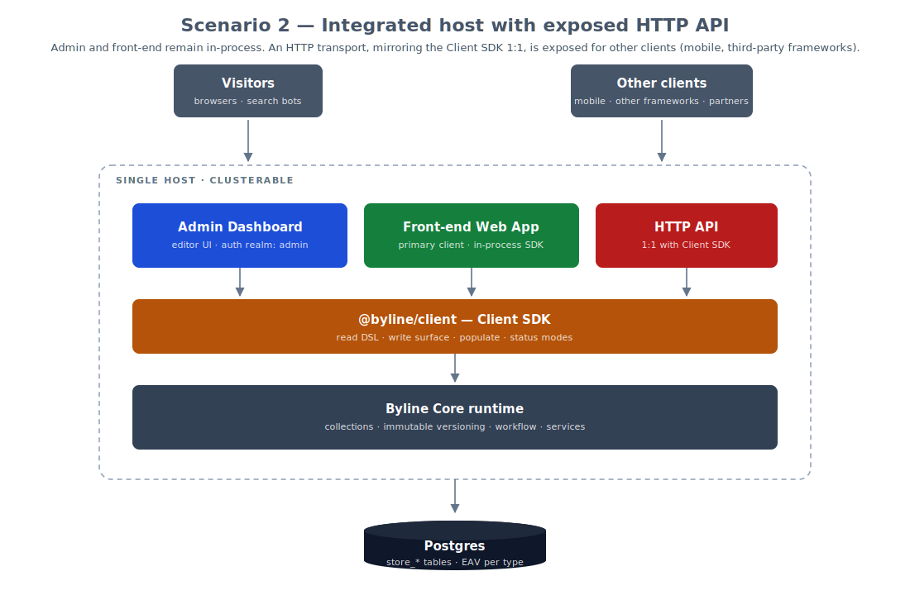
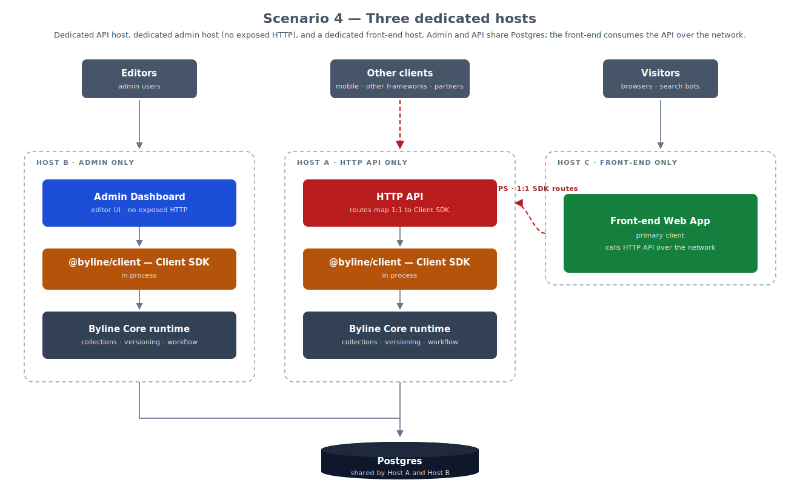

# Byline CMS

A developer-friendly, open-source headless CMS — built with versioning,
editorial workflow, and content translation as first-class concerns rather
than features bolted on later.

> Status: Byline is currently at a stable v2.x.x release. The jump from v1
> to v2 was driven by lockstep versioning across the publishable `@byline/*`
> packages rather than a breaking redesign — the architecture is settled
> and there are unlikely to be any major architectural changes, though
> there is still work to do.
> If you're interested in Byline, v2 is a solid base for evaluation and
> for building on.


<p style="font-size: 0.8rem;"><em>Welcome to the Byline dashboard!</em></p>

## What's different

- **Three pillars, not three plugins.** Versioning, editorial workflow, and
  content translation are foundational and designed to coexist without
  trade-offs.
- **Universal storage (EAV-per-type).** Schemas change without migrations.
  Documents flatten into typed `store_*` tables (text, numeric, boolean,
  datetime, json, file, relation) addressed by a custom path notation —
  indexable, query-friendly, and the basis for selective field loading.
- **Immutable versioning by default.** Every change creates a new
  UUIDv7-ordered version. "Current" is a pointer, not a mutation.
- **Patch-based updates.** Clients accumulate `DocumentPatch[]`; the server
  applies them against the reconstructed document. A foundation for
  collaborative editing later.
- **Schema separated from presentation.** Collection definitions are
  server-safe data; admin UI lives in a parallel `defineAdmin()` config 
  (think Django models vs ModelAdmin, applied to headless content).

For the longer story, see [docs/MISSION.md](docs/MISSION.md) and
[docs/ARCHITECTURE.md](docs/ARCHITECTURE.md).

## Documentation

### Start Here

- **[docs/GETTING-STARTED.md](docs/GETTING-STARTED.md)** — full setup,
  including Postgres bring-up and seeding.

### Background

1. **[docs/MISSION.md](docs/MISSION.md)** — why Byline exists, the three
  pillars, building in the open, and a note on how we use AI in
  development.
1. **[docs/ARCHITECTURE.md](docs/ARCHITECTURE.md)** — key architectural
  decisions in depth, with code examples.
1. **[docs/CORE-DOCUMENT-STORAGE.md](docs/CORE-DOCUMENT-STORAGE.md)** —
   universal storage (EAV-per-type), the seven typed `store_*` tables,
   flatten/reconstruct, immutable versioning, and indicative benchmark
   numbers.
1. **[docs/CORE-COMPOSITION.md](docs/CORE-COMPOSITION.md)** —
    forward-looking roadmap for `createCommand`, module registries,
    a command tree on `BylineCore`, per-realm request-context
    builders, and `loadConfig()`.
1. **[docs/CONTENT-IN-THE-TIME-OF-AI.md](docs/CONTENT-IN-THE-TIME-OF-AI.md)**
  — why we think structured content management matters more, not less,
  alongside generative AI.

### Subsystem Reference

1. **[docs/COLLECTIONS.md](docs/COLLECTIONS.md)** — collection schema and
    admin (columns, layout, preview, custom list views) plus schema
    versioning: Phase 1 (data model + fingerprinting) shipped; Phases
    2–5 (history table, fetch-by-version, in-memory forward migration,
    strict-CI mode) deferred.
1. **[docs/FIELDS.md](docs/FIELDS.md)** - field schemas, admin and field helpers
1. **[docs/DOCUMENT-PATHS.md](docs/DOCUMENT-PATHS.md)** — the `path`
   system attribute (stored in a dedicated `byline_document_paths`
   table keyed by `(document_id, locale)`), `useAsPath`, the slugifier,
   the path widget, and per-locale paths as a future phase.

1. **[docs/RELATIONSHIPS.md](docs/RELATIONSHIPS.md)** — cross-collection
   relations, populate, the relation envelope, recursion safety via
   `ReadContext`, and `hasMany` as a future phase.
1. **[docs/FILE-MEDIA-UPLOADS.md](docs/FILE-MEDIA-UPLOADS.md)** —
   field-level uploads, the two-round-trip flow (field upload then
   document save), `beforeStore`/`afterStore` hooks, and variant
   persistence.
1. **[docs/ROUTING-API.md](docs/ROUTING-API.md)** — the internal
   TanStack-server-fn transport phase, today's server-fn surface, and
   what triggers a stable HTTP boundary.
1. **[docs/AUTHN-AUTHZ.md](docs/AUTHN-AUTHZ.md)** — two auth realms,
   abilities and roles, the `AbilityRegistry`, service-layer
   enforcement, and the `beforeRead` hook.
1. **[docs/CLIENT-SDK.md](docs/CLIENT-SDK.md)** — `@byline/client` as
   an in-process, server-side SDK: read DSL, write surface, populate,
   status modes, and what it deliberately is *not*.
1. **[docs/RICHTEXT.md](docs/RICHTEXT.md)** — pluggable richtext editor
   adapter, the current Lexical implementation, and future phases for
   a second editor.
1. **[docs/CACHING.md](docs/CACHING.md)** — L1/L2 cache layers, the
   reference `publicCacheMiddleware`, cookie-aware CDN bypass for
   editors, invalidation strategies, and clustering trade-offs.
1. **[docs/UIKIT.md](docs/UIKIT.md)** — `@byline/ui` as a single
   brand-coherent UI surface: the foundational kit synced from
   `@infonomic/uikit`, the byline-prefixed cascade-layer system, the
   `pnpm sync:uikit` workflow, and the `./react/{admin,fields,forms,services}`
   subpath exports.

## Deployment Scenarios (Current and Future)

Byline is designed to support a spectrum of deployment shapes, from a single
all-in-one host today to fully split admin / API / front-end topologies in the
future. The four diagrams below sketch the progression.

### 1. Integrated all-in-one host (current)

A single host runs the admin dashboard and the front-end application together.
The Client SDK runs in-process; the host talks directly to Postgres.


### 2. Integrated host with an exposed HTTP API

The same single host now also exposes a public HTTP API that maps 1:1 to the
Client SDK. The front-end keeps using the SDK in-process; external clients
reach Byline through the HTTP API.



### 3. Admin + HTTP API host with a separate front-end host

Two hosts. The Byline host carries the admin dashboard and exposes the HTTP
API; the front-end is deployed independently and consumes that API over the
network.


### 4. Three dedicated hosts

A dedicated HTTP API server, a dedicated admin host (no exposed HTTP), and a
dedicated front-end host. The front-end consumes the API host over the
network; the admin and API hosts share the database.




## Quick start - Experimental CLI

Note: We have an experimental CLI that will attempt to install Byline into an existing TanStack Start application. This has only been tested against up-to-date TanStack Start sites created with the Nitro (agnostic adapter). You can install TanStack Start with:

```sh
npx @tanstack/cli@latest create

#or

pnpm dlx @tanstack/cli@latest create
```
Then be sure to select the Nitro (agnostic) adapter.
```
◆  Select deployment adapter:
│  ○ None
│  ○ Cloudflare
│  ○ Netlify
│  ● Nitro (agnostic)
│  ○ Railway
└
```
Once your TanStack Start application is ready you can initialize a Byline installation with:

```sh
npx @byline/cli@latest init

#or

pnpm dlx @byline/cli@latest init
```
NOTE: If you use `pnpm` - installing dependencies may bail out asking you to `pnpm approve-builds`
You can stop the `cli@latest init` - approve builds, and then re-run `pnpm dlx @byline/cli@latest init` and
it will pick up where it left off. You may need to do this more than once.

If there are any issues, you can follow the example application in this repo under `apps/webapp`.

NOTE: For AI-assisted editing, you'll need to add your API keys as shown in `apps/webapp/.env.example`

IMPORTANT: The core Byline routes will be placed under a pathless route at `routes/_byline`, with its own route.tsx template. To prevent your front-end TanStack Start application's styling from 'leaking' into the Byline dashboard, you'll need to create or move your top-most layout route into its own pathless layout route - for example, under `routes/_font-end` or `routes/_public` - with any styling, headers, footers etc., that might have been in __root.tsx - moved into the route.tsx layout file inside your front-end pathless layout route.

See the TanStack Router docs for [File-Based Routing](https://tanstack.com/router/latest/docs/routing/file-based-routing) and [Virtual File Routes](https://tanstack.com/router/latest/docs/routing/virtual-file-routes) for more information.

NOTE: If you have manually configured Byline by copying code from the example application here (byline directories, .env, start, server, __root.tsx, and vite.config.ts settings), and only want to provision the database and seed the super-admin and example docs in the new application, use `byline setup` instead of `byline init`:

```sh
npx @byline/cli@latest setup

# or

pnpm dlx @byline/cli@latest setup
```

`setup` runs only the database-provisioning and seed phases (`db` → `db-init` → `seed-admin` → `seed-docs`) — it does not touch project files. Useful flag examples:

```sh
# Provision the DB and seed both the super-admin and example docs (default)
byline setup

# Provision the DB and seed the super-admin only
byline setup --no-seed-docs

# Provision the DB and seed example docs only
byline setup --no-seed-admin

# Provision the DB without running either seed
byline setup --no-seed-admin --no-seed-docs

# Destructive: drop and recreate the database (requires both flags)
byline setup --reset --i-mean-it

# Re-run every phase even if recorded as complete (non-destructive on its own —
# migrations re-apply as no-ops, seeds are idempotent)
byline setup --force

# Full nuke-and-pave: drop and recreate the database, then re-run every phase
byline setup --force --reset --i-mean-it
```

Before running any phase, `setup` performs a quick pre-flight: it bails if the core `@byline/*` packages aren't installed in your app's `package.json`, bails if `.env` is missing, and warns-and-confirms if `.env` is present but missing keys Byline expects (some keys may legitimately be supplied via shell env). For new TanStack Start apps that need the full scaffold, use `byline init` instead.

## Quick start - Development environment and example application (this repo)

```sh
git clone git@github.com:Byline-CMS/bylinecms.dev.git
cd bylinecms.dev
pnpm install
pnpm build
```

Bring up Postgres (Docker, default password `test`):

```sh
cd postgres && mkdir data
./postgres.sh up -d
```

Initialise the database, run migrations, and seed:

```sh
cd packages/db-postgres && cp .env.example .env
cd src/database && ./db_init.sh && cd ../..
pnpm drizzle:migrate

# .env configuration
cd ../../apps/webapp && cp .env.local.example .env.local

# generate JWT session key
openssl rand -base64 48
# paste the above output into your .env.local file for
# BYLINE_JWT_SECRET

# Set the seed superadmin username email address and password
# BYLINE_SUPERADMIN_EMAIL=admin@byline.local
# BYLINE_SUPERADMIN_PASSWORD=change-me

pnpm tsx --env-file=.env.local byline/seed.ts
```

Then from the project root:

```sh
pnpm dev
```

Open http://localhost:5173/.

Full notes — including the foot-gun protection on `db_init`, alternate
database names, and what the seed does — are in
[docs/GETTING-STARTED.md](docs/GETTING-STARTED.md).

## FAQ

<details>
<summary>1. Who are you?</summary>
We’re pretty much nobody — at least not within the usual spheres of influence. We're an agency based in Southeast Asia, and we're fairly certain you've never heard of us. That said, we have a lot of experience building content solutions for clients — and we’re tired of fighting frameworks for core features our clients need and expect.
</details>

<details>
<summary>2. Will this work?</summary>
We hope so. The 1.x line is best treated as a release candidate — the core is stable enough to build on, but we're still filling in the edges and discovering where production workloads will press hardest.
</details>

<details>
<summary>3. What governance structures are you considering?</summary>
We really like the governance structure of [Penpot](https://community.penpot.app/t/penpots-upcoming-business-model-for-2025/7328). We're committed to 100% open-source software, with no "open core" or "freemium" gotchas.
</details>

<details>
<summary>4. Would you accept sponsorship?</summary>
Yes!
</details>

<details>
<summary>5. Would you accept venture or seed-round investment?</summary>
We’re not certain yet, and likely not at this early stage. Our priority is to figure out key aspects of the project first. What we feel strongly about, however, is that community contributions should remain accessible — not locked behind an enterprise or paywalled solution. Ultimately, our governance structure and commitment to being community‑driven will guide any financial decisions we make.
</details>

<details>
<summary>6. What's here now?</summary>
The storage, versioning, workflow, auth, client SDK, and admin UI are all in place. We're shipping under the 1.x line but treating it as a release candidate: APIs are stable and the core architecture is settled, with several v1-level capabilities (collection-versioning history, `hasMany` relations, list-view materialisation under load) deferred to fill in across 1.x.
</details>

<details>
<summary>7. Why the Mozilla Public License (MPL-2.0) Version 2.0?</summary>

We chose the MPL as we feel this represents the best balance between community-driven open source software, and allowing commercial value-based services to flourish.

The Mozilla Public License 2.0 (MPL-2.0) is often described as a “file-level copyleft” license. That means it sits somewhere between very permissive licenses (like MIT or BSD) and strong copyleft licenses (like GPL). In simple terms: if someone modifies MPL-licensed source files, those modified files must remain open and distributed under the MPL. However, they can combine those files with their own proprietary code in the same larger project, as long as they keep the MPL files separate and respect the license terms.

This creates a clear boundary. Improvements to the original open-source codebase stay open and benefit the community. At the same time, companies can build additional features, integrations, services, or proprietary modules around it without being required to open-source their entire product. The obligation applies only to the specific MPL-licensed files that are modified or redistributed — not to the entire application.

Practically speaking, if someone uses MPL-licensed software in a commercial product, they can sell that product, host it as a service, or build paid offerings around it. If they modify the original MPL files and distribute those modifications, they must make those specific changes available under the MPL. If they simply link to or use the software without modifying those files, there is no requirement to open their own independent code.

We feel the MPL will help to encourage collaboration and shared maintenance of the core platform, while still supporting sustainable commercial ecosystems — which is why many teams see MPL-2.0 as a pragmatic middle path between fully permissive and strongly reciprocal open-source licenses.
</details>

## License

Mozilla Public License 2.0. See [LICENSE](LICENSE) and [COPYRIGHT](COPYRIGHT).

Copyright © 2026 Infonomic Company Limited

### Major Contributors

- Anthony Bouch — https://www.linkedin.com/in/anthonybouch/ — anthony@infonomic.io
- David Lipsky — https://www.linkedin.com/in/david-lipsky-4391862a8/ — david@infonomic.io
