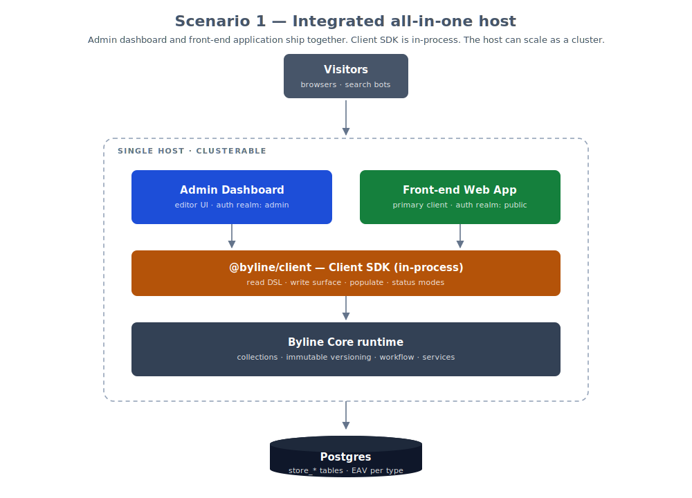

# Byline CMS

A developer-friendly, open-source headless CMS — built with versioning,
editorial workflow, and content translation as first-class concerns rather
than features bolted on later.

> Status: Byline is currently at a stable v4.x release. The major-version
> bumps have been driven by lockstep versioning across the publishable
> `@byline/*` packages rather than breaking redesigns — the architecture is
> settled and there are unlikely to be any major architectural changes, though
> there is still work to do.
> If you're interested in Byline, v4 is a solid base for evaluation and
> for building on. Upgrading from 3.21? See the
> [migration guide](docs/01-getting-started/03-upgrading-to-v4.md).


<p style="font-size: 0.8rem;"><em>Welcome to the Byline dashboard!</em></p>

## What's different

- **Three pillars, not three plugins.** Versioning, editorial workflow, and
  content translation are foundational and designed to coexist without
  trade-offs.
- **Universal storage (EAV-per-type).** Schemas change without migrations.
  Documents flatten into typed `store_*` tables (text, numeric, boolean,
  datetime, json, file, relation) addressed by a custom path notation —
  indexable, query-friendly, and the basis for selective field loading.
- **Immutable versioning by default.** Every change creates a new
  UUIDv7-ordered version. "Current" is a pointer, not a mutation.
- **Patch-based updates.** Clients accumulate `DocumentPatch[]`; the server
  applies them against the reconstructed document. A foundation for
  collaborative editing later.
- **Schema separated from presentation.** Collection definitions are
  server-safe data; admin UI lives in a parallel `defineAdmin()` config
  (think Django models vs ModelAdmin, applied to headless content).

For the longer story, see [docs/02-why-byline/01-mission.md](docs/02-why-byline/01-mission.md) and
[docs/03-architecture/index.md](docs/03-architecture/index.md).

## Documentation

The docs live under [`docs/`](docs/) as a numbered, folder-per-section tree —
itself a Byline-importable markdown repository. Each section has an `index.md`
overview; the highlights below link straight to the per-topic references.

### 1. [Getting Started](docs/01-getting-started/index.md)

- **[CLI](docs/01-getting-started/01-cli.md)** — add
  Byline to an existing TanStack Start app with `byline init` / `setup`.
- **[Development environment](docs/01-getting-started/02-development-environment.md)**
  — clone this repo, bring up Postgres, seed, and run the example app.
- **[Upgrading to v4](docs/01-getting-started/03-upgrading-to-v4.md)** — the
  3.21 → 4.x application migration: package alignment, route configuration,
  server-only hooks, the `@byline/client/server` + `@byline/generated-types`
  import surface, and release validation gates.

### 2. [Why Byline](docs/02-why-byline/index.md)

- **[Mission & Vision](docs/02-why-byline/01-mission.md)** — why Byline exists,
  the three pillars, building in the open, and a note on how we use AI in
  development.
- **[Content in the Time of AI](docs/02-why-byline/02-content-in-the-time-of-ai.md)**
  — why structured content management matters more, not less, alongside
  generative AI.

### 3. [Architecture](docs/03-architecture/index.md)

- **[Document Storage](docs/03-architecture/01-document-storage.md)** — universal
  storage (EAV-per-type), the seven typed `store_*` tables, flatten/reconstruct,
  immutable versioning, and indicative benchmark numbers.
- **[Core Composition](docs/03-architecture/02-core-composition.md)** —
  forward-looking roadmap for `createCommand`, module registries, a command tree
  on `BylineCore`, per-realm request-context builders, and `loadConfig()`.
- **[Transactions](docs/03-architecture/03-transactions.md)** — the transaction
  model spanning storage writes, hooks, and uploads.
- **[Path Grammar](docs/03-architecture/04-path-grammar.md)** — how fields are
  addressed across storage, schemas, patches, forms, and upload configuration:
  the two path notations, when each applies, and their limits.
- **[Deployment Topologies](docs/03-architecture/05-deployment-topologies.md)** —
  the integrated single host available today, and the three split admin / API /
  front-end shapes the architecture is designed to reach.

### 4. [Collections](docs/04-collections/index.md)

Collection schema and admin (columns, layout, preview, custom list views) plus
schema versioning.

- **[Fields](docs/04-collections/01-fields.md)** — field schemas, admin and field helpers.
- **[Blocks](docs/04-collections/02-blocks.md)** — `defineBlock()` schemas, the
  blockType-keyed `defineBlockAdmin()` split, blocks in type generation and
  storage, and inline uploads via `upload.location`.
- **[Relationships](docs/04-collections/03-relationships.md)** — cross-collection
  relations, populate, the relation envelope, recursion safety via
  `ReadContext`, and `hasMany` as a future phase.
- **[Document Trees](docs/04-collections/04-document-trees.md)** — hierarchical
  documents, tree mode, and auto-placement.
- **[Document Paths](docs/04-collections/05-document-paths.md)** — the `path`
  system attribute (stored in a dedicated `byline_document_paths` table keyed by
  `(document_id, locale)`), `useAsPath`, the slugifier, and the path widget.
- **[File & Media Uploads](docs/04-collections/06-file-media-uploads.md)** —
  field-level uploads, the two-round-trip flow, `beforeStore`/`afterStore`
  hooks, and variant persistence.
- **[Rich Text](docs/04-collections/07-rich-text.md)** — pluggable richtext
  editor adapter, the current Lexical implementation, and per-field overrides.
- **[Collection Versioning](docs/04-collections/08-collection-versioning.md)** —
  schema versioning: Phase 1 (data model + fingerprinting) shipped; later phases
  deferred.

### 5. [Reading & Delivery](docs/05-reading-and-delivery/index.md)

- **[Client SDK](docs/05-reading-and-delivery/01-client-sdk.md)** — `@byline/client`
  as an in-process, server-side SDK: read DSL, write surface, populate, status
  modes, the typed `@byline/client/server` getters + `@byline/generated-types`
  registration, and what it deliberately is *not*.
- **[Routing & API](docs/05-reading-and-delivery/02-routing-and-api.md)** — the
  internal TanStack-server-fn transport phase, today's server-fn surface, and
  what triggers a stable HTTP boundary.
- **[Transports](docs/05-reading-and-delivery/03-transports.md)** — layering
  framework-agnostic logic under host-specific bindings.
- **[Markdown Export](docs/05-reading-and-delivery/04-markdown-export.md)** —
  one-way Lexical-to-markdown rendering, the `.md` URL surface, and `llms.txt`
  for agent consumers.
- **[MCP Server](docs/05-reading-and-delivery/05-mcp-server.md)** — exposing
  Byline content to AI agents over the Model Context Protocol.
- **[Caching](docs/05-reading-and-delivery/06-caching.md)** — L1/L2 cache layers,
  the reference `publicCacheMiddleware`, cookie-aware CDN bypass for editors,
  invalidation strategies, and clustering trade-offs.
- **[Search](docs/05-reading-and-delivery/07-search.md)** — the pluggable
  `SearchProvider` seam, the built-in Postgres full-text driver, lifecycle-hook
  indexing, reindex, and the collection `search()` query surface.
- **[Search & Document Extraction](docs/05-reading-and-delivery/08-search-extraction-strategy.md)**
  — forward-looking research for attachment extraction and retrieval: provider
  boundaries, persistence, chunking, and phased delivery.

### 6. [Auth & Security](docs/06-auth-and-security/index.md)

- **[Authentication & Authorization](docs/06-auth-and-security/01-authn-authz.md)**
  — two auth realms, abilities and roles, the `AbilityRegistry`, service-layer
  enforcement, and the `beforeRead` hook with worked row-scoping recipes.
- **[Auditability](docs/06-auth-and-security/02-auditability.md)** — the
  per-version acting-user trail, the document-level audit log, and the history
  and activity views built on top of them.

### 7. [Internationalization](docs/07-internationalization/index.md)

- **[Host i18n](docs/07-internationalization/01-host-i18n.md)** — per-request
  locale resolution and the isomorphic URL rewrite.
- **[Admin Translations](docs/07-internationalization/02-admin-translations.md)**
  — `@byline/i18n`, the `byline-admin` bundle, and the extension surface.
- **[Content Locales](docs/07-internationalization/03-content-locales.md)** —
  translating content independently of the interface.
- **[Administering Locales](docs/07-internationalization/04-administering-locales.md)**
  — configuring and managing locales.

### 8. [Admin UI](docs/08-admin-ui/index.md)

- **[UI Kit](docs/08-admin-ui/01-ui-kit.md)** — `@byline/ui` as a single
  brand-coherent UI surface: the foundational kit shared with `@infonomic/uikit`,
  the byline-prefixed cascade-layer system, and the
  `./react/{admin,fields,forms,services}` subpath exports.
- **[Client-config Registration](docs/08-admin-ui/02-client-config-registration.md)**
  — how the admin/editor config is registered on the client and code-split away
  from public routes.

### 9. [Testing](docs/09-testing.md)

Unit and integration suites, the `byline_test` database, and isolation strategy.

## Deployment Scenarios (Current and Future)

Byline runs today as a single host: the admin dashboard and your front-end
application share one process, and content is read through `@byline/client` as
an in-process call rather than a network request. The architecture is designed
to grow into progressively split topologies — an exposed HTTP API, a separate
front-end host, and three dedicated hosts — each gated on the stable HTTP
boundary that is deliberately deferred until a second, non-admin client exists.



All four deployment scenarios, current and future, are described in
[Deployment Topologies](docs/03-architecture/05-deployment-topologies.md),
with a diagram of each.


## Quick start — add Byline to a TanStack Start application

Byline installs into an existing TanStack Start application. If you need one,
create it first and select the **Nitro (agnostic)** adapter — the adapter the
CLI is tested against:

```sh
npx @tanstack/cli@latest create
```

Then, from the application directory:

```sh
npx @byline/cli@latest init

# or

pnpm dlx @byline/cli@latest init
```

`init` prompts for where to mount the admin UI and sign-in page, how to connect
to PostgreSQL, and whether to include the example collections. It summarises
those choices, along with a diff of every file it plans to write, before
installing anything. When it finishes you have a working admin UI, a
provisioned and migrated database, a seeded super-admin account, and a
`byline/` configuration directory ready to edit.

Two companion commands: `byline setup` provisions and seeds an application you
wired by hand, and `byline doctor` reports which installation phases are
complete.

> **Keep public and admin layouts separate.** Byline's routes are installed
> under a pathless `routes/_byline` layout. Move your public application's
> top-level layout into a separate pathless route — for example
> `routes/_public` — with the styling, headers, and footers that were in
> `__root.tsx` moved into that layout's `route.tsx`. This prevents public
> styles from affecting the Byline dashboard.

The [CLI guide](docs/01-getting-started/01-cli.md) covers the full
walkthrough: every prompt, the available flags, `byline setup`, and what the
installer does under the hood.

## Quick start — development environment and example application (this repo)

```sh
git clone git@github.com:Byline-CMS/bylinecms.dev.git
cd bylinecms.dev
pnpm install
pnpm build
```

Bring up Postgres (Docker, default password `test`):

```sh
cd postgres && mkdir data
./postgres.sh up -d
```

Initialise the database and run migrations, from the repository root:

```sh
cp packages/db-postgres/.env.example packages/db-postgres/.env
pnpm db:init
pnpm drizzle:migrate
```

Configure the webapp and seed it:

```sh
cd apps/webapp
cp .env.local.example .env.local

# Generate a JWT session key, and paste the output into .env.local as
# BYLINE_JWT_SECRET
openssl rand -base64 48

# Then set the super-admin credentials the seed will create:
# BYLINE_SUPERADMIN_EMAIL=admin@byline.local
# BYLINE_SUPERADMIN_PASSWORD=change-me

pnpm tsx --env-file=.env.local byline/seed.ts
```

Then from the project root:

```sh
pnpm dev
```

Open http://localhost:5173/.

The [development environment guide](docs/01-getting-started/02-development-environment.md)
has the full notes, including the foot-gun protection on `db_init`, alternate
database names, and what the seed does.

## FAQ

<details>
<summary>1. Who are you?</summary>
We’re pretty much nobody — at least not within the usual spheres of influence. We're an agency based in Southeast Asia, and we're fairly certain you've never heard of us. That said, we have a lot of experience building content solutions for clients — and we’re tired of fighting frameworks for core features our clients need and expect.
</details>

<details>
<summary>2. Will this work?</summary>
We hope so. Core is stable, but there's certainly still work to do.
</details>

<details>
<summary>3. What governance structures are you considering?</summary>
We really like the governance structure of [Penpot](https://community.penpot.app/t/penpots-upcoming-business-model-for-2025/7328). We're committed to 100% open-source software, with no "open core" or "freemium" gotchas.
</details>

<details>
<summary>4. Would you accept sponsorship?</summary>
Yes!
</details>

<details>
<summary>5. Would you accept venture or seed-round investment?</summary>
We’re not certain yet, and likely not at this early stage. Our priority is to figure out key aspects of the project first. What we feel strongly about, however, is that community contributions should remain accessible — not locked behind an enterprise or paywalled solution. Ultimately, our governance structure and commitment to being community‑driven will guide any financial decisions we make.
</details>

<details>
<summary>6. What's here now?</summary>
The storage, versioning, workflow, auth, client SDK, and admin UI are all in place. We're shipping under the 4.x line: APIs are stable and the core architecture is settled, with several capabilities (collection-versioning history, `hasMany` relations, a stable public HTTP API, list-view materialisation under load) deferred to fill in across the 4.x line.
</details>

<details>
<summary>7. Why the Mozilla Public License (MPL-2.0) Version 2.0?</summary>

We chose the MPL as we feel this represents the best balance between community-driven open source software, and allowing commercial value-based services to flourish.

The Mozilla Public License 2.0 (MPL-2.0) is often described as a “file-level copyleft” license. That means it sits somewhere between very permissive licenses (like MIT or BSD) and strong copyleft licenses (like GPL). In simple terms: if someone modifies MPL-licensed source files, those modified files must remain open and distributed under the MPL. However, they can combine those files with their own proprietary code in the same larger project, as long as they keep the MPL files separate and respect the license terms.

This creates a clear boundary. Improvements to the original open-source codebase stay open and benefit the community. At the same time, companies can build additional features, integrations, services, or proprietary modules around it without being required to open-source their entire product. The obligation applies only to the specific MPL-licensed files that are modified or redistributed — not to the entire application.

Practically speaking, if someone uses MPL-licensed software in a commercial product, they can sell that product, host it as a service, or build paid offerings around it. If they modify the original MPL files and distribute those modifications, they must make those specific changes available under the MPL. If they simply link to or use the software without modifying those files, there is no requirement to open their own independent code.

We feel the MPL will help to encourage collaboration and shared maintenance of the core platform, while still supporting sustainable commercial ecosystems — which is why many teams see MPL-2.0 as a pragmatic middle path between fully permissive and strongly reciprocal open-source licenses.
</details>

## License

Mozilla Public License 2.0. See [LICENSE](LICENSE) and [COPYRIGHT](COPYRIGHT).

Copyright © 2026 Infonomic Company Limited

### Major Contributors

- Anthony Bouch — https://www.linkedin.com/in/anthonybouch/ — anthony@infonomic.io
- David Lipsky — https://www.linkedin.com/in/david-lipsky-4391862a8/ — david@infonomic.io
