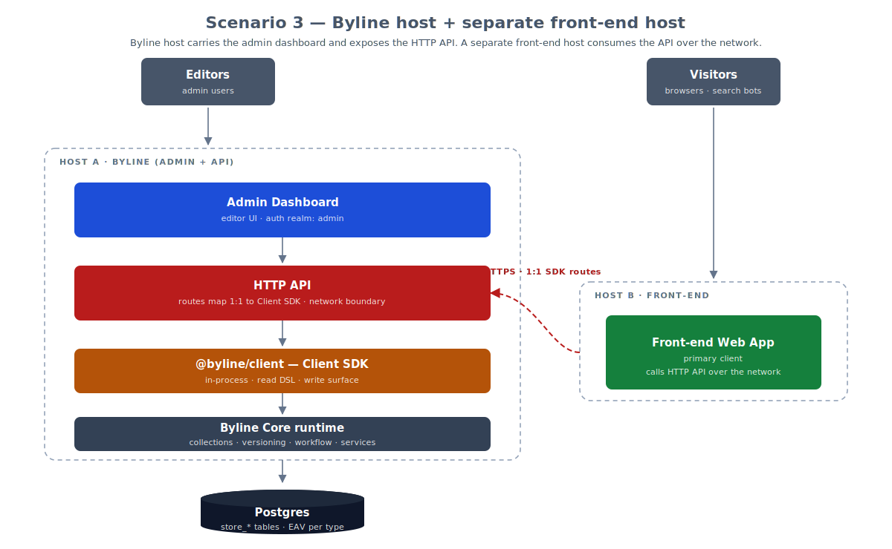

# Deployment Topologies

Companions:
- [Client SDK](../05-reading-and-delivery/01-client-sdk.md) — the in-process SDK that every topology below is built around.
- [Routing & API](../05-reading-and-delivery/02-routing-and-api.md) — the current server-function transport and the conditions under which a stable HTTP API becomes worthwhile.
- [Transports](../05-reading-and-delivery/03-transports.md) — the planned layering of framework-agnostic logic under host-specific bindings, which is what makes the split topologies possible.
- [Caching](../05-reading-and-delivery/06-caching.md) — the cache layers and invalidation strategy that change shape once a network boundary appears.

Byline runs today as a single application: the admin dashboard and your
front-end share one host, and content is read through `@byline/client` as an
in-process function call rather than a network request. This document describes
that arrangement, and the three progressively more distributed arrangements
Byline is designed to grow into. Read it when you are deciding how to deploy
Byline, or assessing whether a topology you eventually need is one the
architecture can reach.

Only the first scenario is available today. The other three depend on a stable
public HTTP API, which is deliberately deferred — see
[Not yet shipped](#not-yet-shipped) at the end of this document.

## What stays constant

Every topology below is a rearrangement of the same four parts, so it is worth
naming them before the diagrams:

| Part | What it is |
|---|---|
| **Admin dashboard** | Byline's editor UI, served under the `_byline` route group. Operates in the `admin` auth realm. |
| **Front-end application** | Your public site — the primary content consumer. Operates in the `public` auth realm. |
| **`@byline/client`** | The Client SDK: read DSL, write surface, populate, and status modes. In-process in every scenario; what changes is *who* calls it. |
| **Byline Core runtime** | Collections, immutable versioning, workflow, and the services the SDK delegates to, over a Postgres database of `store_*` tables. |

The constant across all four is that the SDK is always in-process with the core
runtime. Byline does not have a mode where the SDK itself talks to a remote
server; a network boundary is introduced by putting an HTTP API *in front of*
an in-process SDK, never by splitting the SDK from the runtime it calls.

## Scenario 1 — Integrated all-in-one host

**Available today.** A single host runs the admin dashboard and the front-end
application together. The Client SDK runs in-process and the host talks directly
to Postgres. The host can still be clustered: multiple identical instances
behind a load balancer share one database.

This is the shape the reference application (`apps/webapp`) and the CLI
installer both produce. It has no network hop between the front-end and the
content it renders, which is why reads are function calls and the SDK can be
typed end to end against your generated collection types.

## Scenario 2 — Integrated host with an exposed HTTP API

The same single host additionally exposes a public HTTP API whose routes map
1:1 onto the Client SDK surface. The front-end keeps calling the SDK
in-process — it gains nothing from crossing the network to reach its own
host — while mobile applications, other frameworks, and partner integrations
reach Byline over HTTP.

The 1:1 mapping is the important constraint. The HTTP layer is a transport over
the SDK, not a second content API with its own semantics — so query behaviour,
populate, and status modes stay identical whichever way a client arrives.

## Scenario 3 — Byline host with a separate front-end host

Two hosts. Host A carries the admin dashboard and exposes the HTTP API; the
front-end is deployed and scaled independently on Host B, consuming that API
over the network.

This is the first topology where the front-end pays a network cost per read,
and therefore the first where caching stops being an optimisation and becomes
part of the design. It suits teams who want to deploy and scale the public site
on a different cadence — or a different platform — from the CMS.

## Scenario 4 — Three dedicated hosts

Three hosts, each with one job: a dedicated HTTP API host, a dedicated admin
host with no exposed HTTP surface, and a dedicated front-end host. The
front-end consumes the API host over the network; the admin and API hosts share
one Postgres database.

Both Byline hosts run their own in-process SDK and core runtime against the
shared database — consistent with the rule above that the SDK is never split
from its runtime. The admin host exposing no HTTP surface is the point of this
arrangement: the editor application can sit entirely inside a private network
while the API host is the only publicly reachable Byline component.

## Not yet shipped

Scenarios 2, 3, and 4 all require a stable public HTTP API, which Byline does
not yet expose. The only client today is the admin UI, so collection operations
are handled through TanStack Start server functions rather than
framework-agnostic HTTP endpoints. That boundary is deferred until a second,
non-admin client exists to design it against — see
[Routing & API](../05-reading-and-delivery/02-routing-and-api.md) for the
reasoning, and [Transports](../05-reading-and-delivery/03-transports.md) for the
layering that would carry it.

The diagrams describe an intended progression, not a roadmap with dates. Treat
scenario 1 as the supported deployment and the rest as the shapes the
architecture is being kept honest against.
